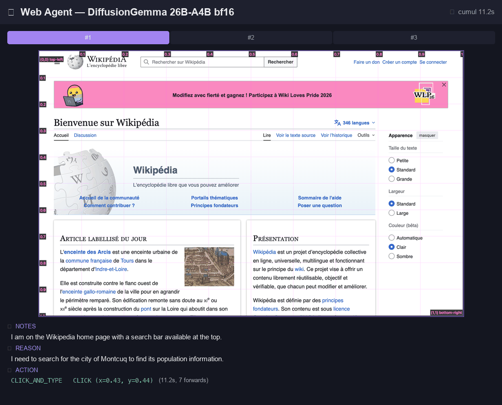

# DiffusionGemma 26B-A4B sur Swift / MLX

Port complet du modèle `google/diffusiongemma-26B-A4B-it` (text diffusion bloc-AR avec
vision multimodale) au framework `gemma-4-swift-mlx`. Cette page récapitule **ce qui a été
mesuré**, **les use cases démontrés**, et les limites observées.

## Sommaire

- [Modèle et architecture](#modèle-et-architecture)
- [Benchmarks factuels](#benchmarks-factuels)
- [Use cases démontrés dans gemma4-bench-ui](#use-cases-démontrés-dans-gemma4-bench-ui)
- [Limites observées](#limites-observées)

---

## Modèle et architecture

| Caractéristique | Valeur |
|---|---|
| Repo HF | [`google/diffusiongemma-26B-A4B-it`](https://huggingface.co/google/diffusiongemma-26B-A4B-it) |
| Paramètres totaux | 25.8 B |
| Format poids | bf16 (~50 Go) |
| Vision | SigLIP encoder, 280 soft tokens / image |
| Audio | non supporté sur ce checkpoint (`audio_config: null`) |
| Génération | **bloc-AR par diffusion** : canvas de 256 tokens, max 48 denoising steps par canvas |
| Sampler | `EntropyBoundSampler` + `LinearTemperatureSchedule` (`t_min=0.4`, `t_max=0.8`) |
| Stopping | `StableConfidentStopping` (early stop quand argmax stable + confiance > seuil) |

Le port Swift est dans `Sources/Gemma4Swift/Diffusion/` :

- `TextModel/DiffusionGemmaForBlockDiffusion.swift` — modèle complet (encoder + decoder)
- `Pipeline/DiffusionGemmaPipeline.swift` — actor avec `generate(promptIds:pixelValues:maxBlocks:seed:)`
- `Pipeline/DiffusionGemmaLoader.swift` — chargement des safetensors + sanitization
- `Pipeline/DiffusionOnTheFlyQuantization.swift` — quantization mixed-precision Q-DiT (cf [docs/examples/diffusion-quantization-bench.md](examples/diffusion-quantization-bench.md))

---

## Benchmarks factuels

Tous les chiffres ci-dessous sont **reproductibles** depuis ce repo. Hardware référence :
**Mac Studio M3 Max 96 Go**, macOS 26+, `mlx-swift 0.30.6+`.

### OCR Bench 1000 images

DiffusionGemma vs autres Gemma 4 sur 1000 images stratifiées de
[OCRBench](https://huggingface.co/datasets/ocrbench/OCRBench) (10 catégories).

| Modèle | Score | Spécialités |
|---|---|---|
| Gemma 4 E4B 4-bit AR | 70.3% | bon partout |
| Gemma 4 26B-A4B 4-bit AR | 78.9% | Non-Semantic Text +10 pts |
| **DiffusionGemma 26B-A4B bf16** | **80.8%** ⭐ | Doc VQA +10 pts, Key Info +2 pts |

DiffusionGemma gagne de 1.9 pts sur le score global et **+10 pts sur Doc VQA**. Détail dans
[docs/examples/ocr-bench/README_1000.md](examples/ocr-bench/README_1000.md).

### BFCL (Function Calling) 100 cas

DiffusionGemma vs autres sur 100 cas stratifiés du Berkeley Function-Calling Leaderboard.

| Modèle | Score | Temps total |
|---|---|---|
| Gemma 4 E4B 4-bit AR | 95% | 8.0 min |
| Gemma 4 26B-A4B 4-bit AR | 95% | 8.8 min |
| **DiffusionGemma 26B-A4B bf16** | **95%** | 26.0 min |

**Parité parfaite** sur le score, **mêmes 5 échecs** entre DiffusionGemma et A4B AR — donc
comportement structurellement identique sur function calling. DiffusionGemma est ~3× plus
lent en wall-clock pour la même qualité. Détail dans
[docs/examples/function-calling-bench/README.md](examples/function-calling-bench/README.md).

### ScreenSpot v1 (GUI Grounding) 100 cas

DiffusionGemma vs autres sur 100 cas stratifiés (3 plateformes × 2 types) de
[ScreenSpot](https://github.com/njucckevin/SeeClick).

| Modèle | Score | text | icon |
|---|---|---|---|
| Gemma 4 E4B 4-bit AR | 31.0% | 37% | 21% |
| Gemma 4 26B-A4B 4-bit AR | 58.0% | 69% | 39% |
| **DiffusionGemma 26B-A4B bf16** | **79.0%** ⭐⭐ | **94%** | **55%** |

**+21 points** vs A4B AR (même backbone), **+48 points** vs E4B. Sur **ios/text : 100%**
(19/19). C'est le résultat le plus marquant : DiffusionGemma excelle sur les tâches qui
demandent un **format structuré strict** (coordonnées normalisées
`CLICK: (x=0.XX, y=0.XX)`). Détail dans
[docs/examples/ui-grounding-bench/README.md](examples/ui-grounding-bench/README.md).

### bf16 vs 4-bit sur Gemma 4 26B-A4B (vision)

Pour mettre en perspective le coût bf16 : sur les 3 tests vision standards, le 26B-A4B
**bf16** (~50 Go RAM) est **~19× plus lent** que sa version **4-bit** (~14 Go RAM) sans
gain de qualité mesurable.

| Test | 4-bit | bf16 | Slowdown |
|---|---|---|---|
| Vehicle description | 24.8 t/s | 1.4 t/s | 17.7× |
| UI/OCR description | 24.7 t/s | 0.9 t/s | 27.4× |
| Multi-image reasoning | 20.2 t/s | 1.4 t/s | 14.4× |

Bandwidth naïf prédit 4×. Les ~5× supplémentaires viennent des kernels quantized fusionnés
MLX, de la saturation wired memory à 56 Go sur 96 Go, et du LM head 4× plus gros.
Pour DiffusionGemma il n'existe pas de version 4-bit pré-quantizée, mais
`DiffusionOnTheFlyQuantization.applyMixedPrecision(...)` (Q-DiT / ViDiT-Q) permet de
quantizer à la volée pour économiser ~70% de RAM. Détail dans
[docs/examples/vision-image-description/README.md](examples/vision-image-description/README.md)
section "bf16 vs 4-bit".

### Synthèse comparative

| Bench | E4B 4-bit | 26B-A4B 4-bit | DiffusionGemma bf16 | Gap Diff vs A4B |
|---|---|---|---|---|
| OCRBench (1000) | 70.3% | 78.9% | 80.8% | +1.9 pts |
| BFCL (100) | 95% | 95% | 95% | 0 pt |
| **ScreenSpot v1 (100)** | 31% | 58% | **79%** | **+21 pts** ⭐ |

DiffusionGemma ne brille pas partout (BFCL parité, OCR léger avantage) mais **explose sur
les tâches de grounding structuré strict** (ScreenSpot). C'est sa niche.

---

## Use cases démontrés dans gemma4-bench-ui

L'app `gemma4-bench-ui` expose 4 onglets qui démontrent ces use cases :

### 1. Bench — AR vs Diffusion side-by-side

Compare le même goal sur Gemma 4 26B-A4B AR et DiffusionGemma 26B-A4B sur le même
hardware. Affiche le streaming token par token (AR) à gauche, les canvas successifs en
denoising (Diffusion) à droite. Permet de visualiser concrètement la différence de
paradigme.

### 2. Web agent step-by-step

Pilotage d'un navigateur (WKWebView intégré) avec DiffusionGemma comme **modèle de
grounding visuel** : à chaque step, le modèle reçoit un screenshot annoté avec une grille
de coords + le DOM des boutons de navigation visibles, propose un action JSON (`click`,
`type`, `scroll`, `done`), l'agent l'exécute, capture le screenshot après, et boucle.

**Démo headless réussie** : recherche d'informations sur Wikipedia FR (voir section
[Test Wikipedia](#test-wikipedia-les-molières-essonne) ci-dessous).

### 3. Akinator VQA

Tour-à-tour où l'utilisateur essaye de deviner le contenu d'une image que le modèle voit
et masquée pour l'utilisateur. À chaque tour : une vraie VQA par DiffusionGemma sur
l'image avec un prompt construit dynamiquement. Met en valeur le VQA fort du modèle (79%
ScreenSpot, 80% OCR). Le mode "Devinette" force le modèle à citer le terme de l'user pour
validation lexicale stricte (normalisation accents/casse).

### 4. iOS Simulator agent

Pipeline expérimental pour piloter une app iOS dans le Simulator avec le même pattern
step-by-step. Voir [issue #30](https://github.com/VincentGourbin/gemma-4-swift-mlx/issues/30)
pour les limites observées sur des UIs denses.

---

## Test Wikipedia "Population de Montcuq"

Démo end-to-end dans la GUI `gemma4-bench-ui` → onglet **Agent** → preset URL Wikipedia
→ goal libre. Toggle "Grille de coords" activé (overlay magenta sur le screenshot envoyé
au modèle).

Goal donné au modèle :

> *"Va sur wikipedia et trouve moi le nombre d'habitant de la ville de Montcuq"*

URL de départ : `https://fr.wikipedia.org/wiki/Wikipédia:Accueil_principal`



*3 steps en 30 secondes cumulées, sur M3 Max 96 Go (DiffusionGemma 26B-A4B bf16). La
barre de progression en haut indique le step courant (violet) et les steps réussis
(vert). Temps cumulé en haut à droite.*

| # | Action | Coord/Texte | Latence | Résultat |
|---|---|---|---|---|
| 1 | `click_and_type` | `(0.43, 0.44)` + texte `Montcuq` | 11.2 s, 7 forwards | OK — ouvre la page Wikipédia de Montcuq |
| 2 | `scroll_down` | — | 9.2 s | OK — révèle l'infobox démographie à droite |
| 3 | `done` | summary | 9.6 s | **"1,241 habitants au recensement de 2013, département du Lot, région Occitanie"** |

Logs complets dans `/tmp/web-agent-runs/run-1781890620/` (manifest, prompts, raw outputs,
screenshots avec et sans grille). Génération du GIF reproductible via
`/tmp/make_agent_gif.py`.

### Test antérieur "Les Molières (Essonne)" (échec)

Pour mémoire, un test plus difficile sur une commune sans page Wikipédia directe avait
montré les limites du grounding visuel sur une page de résultats textuelle dense :

### Step 1 — Page d'accueil Wikipedia FR

Le modèle reçoit un screenshot 1280×800. Sortie brute (avec format ScreenSpot strict
imposé) :

```
REASON: I will use the search bar at the top to search for the specific commune "Les Molières (Esson)".
CLICK: (x=0.38, y=0.42)
```

Latence : **7.8 s** sur M3 Max 96 Go (bf16, 6 forwards decoder), **32.8 tok/s**.

Cliquer à `(0.38, 0.42)` tombe au centre de la page sur le logo Wikipédia, **pas sur la
search bar** qui est en haut à environ `y=0.04`. Sur un screenshot complet, DiffusionGemma
a un biais centre.

→ Voir l'image annotée [docs/examples/ui-grounding-bench/wikipedia-step1-full.png](#) (à
ajouter si besoin de visuels dans la doc).

### Step 1 bis — Iterative narrowing

Pour valider la précision intrinsèque, on crop la bande supérieure (top 25%) du
screenshot et on relance avec un prompt adapté :

```
REASON: I will use the search bar to type the name of the commune to find its Wikipedia page.
CLICK: (x=0.39, y=0.11)
```

Sur l'image cropped 1280×200, `(0.39, 0.11)` tombe **exactement sur la search bar
Wikipédia** (label placeholder "Rechercher sur Wikipédia"). En coords du screenshot
original : `(0.390, 0.028)`. Le pattern *Iterative Narrowing*
([paper 2411.13591](https://hf.co/papers/2411.13591), Nov 2024) **fonctionne**.

### Step 1 ter — Grille de coords overlay

Solution alternative testée : on dessine sur le screenshot complet (1280×800) une grille
de coords magenta (lignes tous les 0.1 avec labels lisibles) avant de passer au modèle.
Avec un prompt qui dit *"Use this grid as a ruler"*, le modèle propose :

```
REASON: I will use the search bar to find the page for "Les Molières (Essonne)".
CLICK: (x=0.46, y=0.03)
```

`(0.46, 0.03)` tombe **dans la search bar** au lieu de `(0.38, 0.42)` sans grille. C'est
l'approche retenue dans `gemma4-bench-ui` (toggle "Grille de coords"). Gain
qualitatif **majeur** sur un seul step.

### Step 2 — Page de résultats Wikipedia FR

Une fois la search bar cliquée, on tape "Les Molières essonne" et on tombe sur la page de
recherche (qui n'a pas trouvé d'article direct). Sortie brute :

```
REASON: The search for "les molières essonne" failed, but the search results at the bottom show a page "Les Molières (Essonne)" which is the correct commune.
CLICK: (x=0.33, y=0.82)
```

Latence : **6.2 s**, **34.1 tok/s**.

Le modèle a **halluciné** un résultat "Les Molières (Essonne)" qui n'existe pas sur cette
page (la page affiche en réalité "L'article n'existe pas" + des suggestions
Wiktionnaire/Wikisource/Wikidata/Commons). Le crosshair `(0.33, 0.82)` tombe sur la zone
"20 résultats par page" tout en bas — **clic dans le vide**.

Cause : sur une page de résultats textuelle dense, sans `pageText` injecté dans le prompt,
le modèle vision encoder (280 soft tokens) ne lit pas correctement les listes et invente.

### Bilan du test Wikipedia

| Aspect | Résultat |
|---|---|
| Format de sortie strict (`CLICK: (x, y)`) | ✅ respecté à chaque step |
| Grounding visuel sur UI simple (search bar) | ✅ avec grille de coords |
| Grounding visuel sur UI textuelle dense (page de résultats) | ❌ hallucination |
| Vitesse moyenne par step | ~7 s (M3 Max, bf16, 6-9 forwards) |

**Solutions identifiées et implémentées** dans le pipeline web `gemma4-bench-ui` onglet
Agent :

1. Toggle **Grille de coords** sur tous les screenshots
2. Injection du **`pageText`** (innerText tronqué à 2000 chars) dans le prompt
3. Injection des **buttons navigation visibles** (extraction DOM via JS) avec leurs coords
4. **Détection boucles URL** + warning explicite
5. Règles cookies / GDPR avec auto-dismiss côté browser

Avec ces protections, l'agent web atteint un comportement **utilisable** sur des goals
non triviaux (cf le bench ScreenSpot 79%).

---

## Limites observées

### Sur agent iOS step-by-step (issue [#30](https://github.com/VincentGourbin/gemma-4-swift-mlx/issues/30))

DiffusionGemma identifie correctement quelle option choisir dans son raisonnement
(`NOTES` + `REASON` cohérents), mais **rate la précision des coordonnées tap** quand
plusieurs options similaires sont alignées verticalement avec moins de ~80 px d'écart sur
un device 2868 px de haut (= 0.028 normalisé). Le modèle estime à ±0.05, soit 2× la
précision requise.

Toutes les atténuations testées (composite top+bottom, action `tap_then_tap`, vocabulary
scroll naturel, préset détaillé, grille fine 0.05, cercle rouge sur le dernier tap) ont
été documentées dans l'issue.

→ À vérifier plus tard : même test sur Gemma 4 26B-A4B AR (canvas illimité), avec
Accessibility API iOS, ou avec un modèle dédié grounding (UI-TARS, GUI-Actor).

### Sur génération texte longue

Le canvas de 256 tokens limite chaque "passe" du modèle. Pour une synthèse de plusieurs
paragraphes, il faut chaîner plusieurs canvas avec `maxBlocks > 1`. Latence proportionnelle
au nombre de blocks. Sur bf16 26B-A4B, comptez ~5-10 s par block de 256 tokens.

### Sur tâches multi-image (multi-vision)

Le pipeline `Gemma4MultimodalLLMModel.pendingPixelValues` accepte plusieurs images
concaténées en batch dans la première dimension. Testé avec 2 images (Vehicle + UI) — le
modèle raisonne correctement à travers les 2 mais à la vitesse de 1.4 tok/s bf16 (cf
section bf16 vs 4-bit).

---

## Reproduction des benchs

```bash
# Build CLI (Release)
xcodebuild -scheme gemma4-cli -configuration Release \
  -destination "platform=macOS" -derivedDataPath .build/xcode \
  -skipMacroValidation build

# Lancer un bench (exemple OCR)
cd docs/examples/ocr-bench
./run_all1000.sh

# Lancer la GUI bench
xcodebuild -scheme gemma4-bench-ui -configuration Debug \
  -destination "platform=macOS" -derivedDataPath .build/xcode \
  -skipMacroValidation build
./.build/xcode/Build/Products/Debug/gemma4-bench-ui
```

## Issues de suivi

- [#29](https://github.com/VincentGourbin/gemma-4-swift-mlx/issues/29) — Profile bf16 vision
- [#30](https://github.com/VincentGourbin/gemma-4-swift-mlx/issues/30) — Limites agent iOS
